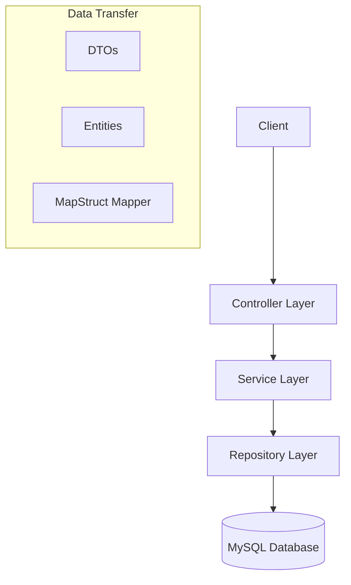

# 📋 Task Management REST API

<div align="center">


</div>

<p align="center">
  <strong>A robust and scalable RESTful API for managing tasks, built with modern Java practices and Spring Boot.</strong>
</p>

<p align="center">
  <a href="#-features">Features</a> •
  <a href="#-tech-stack">Tech Stack</a> •
  <a href="#-architecture">Architecture</a> •
  <a href="#-api-endpoints">API Endpoints</a> •
  <a href="#-getting-started">Getting Started</a>
</p>

---

## 🚀 Features

- **CRUD Operations**: Complete Create, Read, Update, and Delete functionality for tasks.
- **Advanced Search**: Search tasks by name with partial matching.
- **Pagination & Sorting**: Efficiently handle large datasets with customizable pagination and sorting options.
- **Data Validation**: Robust input validation using Jakarta Validation constraints.
- **Exception Handling**: Centralized global exception handling for consistent error responses.
- **DTO Pattern**: Separation of concerns using Data Transfer Objects (DTOs) for requests and responses.
- **Object Mapping**: Automated mapping between Entities and DTOs using MapStruct.
- **Auditing**: Automatic tracking of creation and modification timestamps.

## 🛠 Tech Stack

- **Core**: Java 21
- **Framework**: Spring Boot 3.5.8
- **Database**: MySQL 9.4.0
- **ORM**: Spring Data JPA (Hibernate)
- **Tools & Libraries**:
    - **Lombok**: Reduces boilerplate code.
    - **MapStruct**: Type-safe bean mapping.
    - **Maven**: Dependency management and build tool.

## 🏗 Architecture

This project follows a clean, layered architecture to ensure separation of concerns and maintainability:



- **Controller**: Handles HTTP requests and responses.
- **Service**: Contains business logic.
- **Repository**: Interacts with the database.
- **DTOs**: Defines the structure of data sent to and from the API.
- **Mapper**: Converts between DTOs and Entities.
- **GlobalException**: Centralized error handling using `@ControllerAdvice`.

## 🔌 API Endpoints

### Tasks

| Method | Endpoint | Description |
| :--- | :--- | :--- |
| `GET` | `/tasks` | Retrieve all tasks (supports pagination & sorting) |
| `GET` | `/tasks/{id}` | Retrieve a specific task by ID |
| `POST` | `/tasks` | Create a new task |
| `PUT` | `/tasks/{id}` | Update an existing task |
| `DELETE` | `/tasks/{id}` | Delete a task |
| `GET` | `/tasks/search` | Search tasks by name |

#### Query Parameters for `GET /tasks`
- `page`: Page number (default: 0)
- `size`: Items per page (default: 20)
- `sortBy`: Field to sort by (default: "createdAt")
- `direction`: Sort direction ("asc" or "desc", default: "desc")

## 🏁 Getting Started

### Prerequisites

- Java 21 SDK
- Maven
- MySQL Server

### Installation

1. **Clone the repository**
   ```bash
   git clone https://github.com/R00t105/Task-Management.git
   cd Task-Management
   ```

2. **Configure Database**
   Update `src/main/resources/application.properties` with your MySQL credentials:
   ```properties
   spring.datasource.url=jdbc:mysql://localhost:3306/your_database_name
   spring.datasource.username=your_username
   spring.datasource.password=your_password
   ```

3. **Build the project**
   ```bash
   mvn clean install
   ```

4. **Run the application**
   ```bash
   mvn spring-boot:run
   ```

The API will be available at `http://localhost:8080`.

---

<div align="center">
  Made with ❤️ by [Your Name]
</div>
